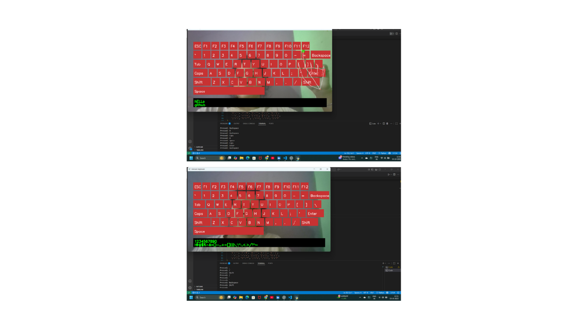

# 🎹 Virtual Keyboard Control With Hand Gestures

A **virtual keyboard** controlled by your **hand gestures** using **OpenCV, MediaPipe, and PyAutoGUI**.  
This project allows you to press keys on an on-screen keyboard without touching your physical keyboard —  
just use your **index + thumb pinch gesture** to press keys.

---

## 🚀 Features
- 🖐️ Hand gesture detection using **MediaPipe**  
- ⌨️ Full virtual keyboard with **letters, numbers, and special keys**  
- 🔊 Sound feedback on key press (click.wav)  
- 🔠 **Caps Lock / Shift support** for uppercase and special characters  
- 📝 Text preview box below keyboard (shows typed text like "Hello World")  
- ↩️ Supports **Enter, Space, Backspace, Tab, ESC**  
- ⚡ Debouncing to prevent accidental double presses  

---

## 🛠️ Installation
### Clone this repo
git clone https://github.com/Lipaprusty2004/Virtual-Keyboard-Control-With-Hand-Gestures.git
cd Virtual-Keyboard-Control-With-Hand-Gestures

2. Install dependencies
   pip install opencv-python mediapipe pyautogui pygame numpy

▶️ Usage

Run the Python script:  
   python keyboard1.py

---

Controls:

✋ Place your hand in front of the camera

👉 Use index + thumb pinch gesture to press a key

📝 Typed text will appear on-screen below the keyboard

❌ Press ESC on your physical keyboard to quit 

---

## 📸 Demo Screenshot

---

📂 Project Structure
Virtual-Keyboard-Control-With-Hand-Gestures/

│── keyboard1.py              # Main script

│── screenshot.png      # Demo screenshot

│── README.md           # Project documentation

---

🤝 Contribution

Pull requests are welcome!
If you have ideas for improving the keyboard (more gestures, better UI, etc.), feel free to fork and contribute.

📜 License

This project is licensed under the MIT License.
You are free to use, modify, and distribute it.

👨‍💻 Developed by Lipa Prusty

   
